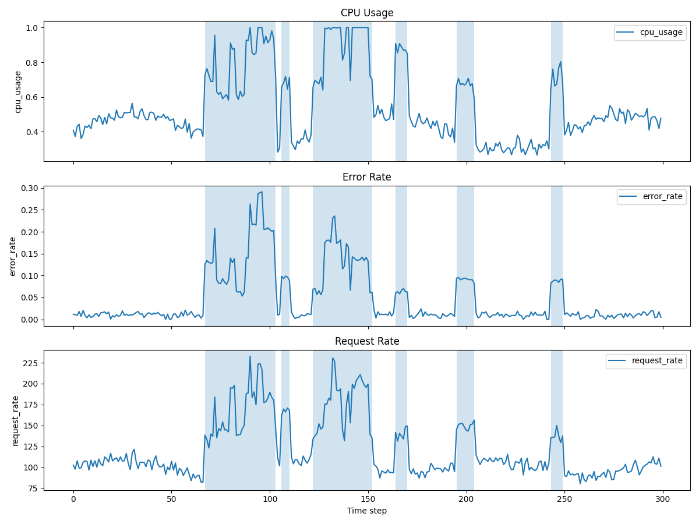
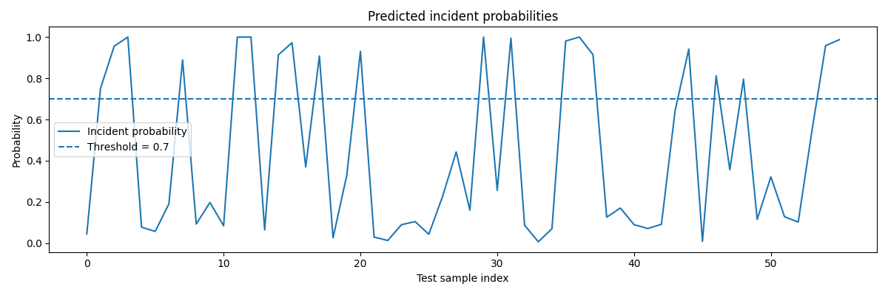

# Predictive Cloud Alerting

A baseline predictive alerting system for cloud-service metrics using a sliding-window formulation and logistic regression.

## Project goal

The goal of this project is to predict whether an incident will occur within the next **H** time steps based on the previous **W** steps of service metrics.

In this prototype:

- **W (window size)** is the number of past time steps used as input
- **H (horizon)** is the number of future time steps in which an incident is predicted

The task is formulated as a **binary classification** problem:

- `1` — an incident will occur within the next `H` steps
- `0` — no incident will occur within the next `H` steps

## Synthetic dataset

To keep the project focused on problem formulation, model design, and evaluation, I used a **synthetic multivariate time-series dataset** instead of a large real-world dataset.

The generated metrics are:

- `cpu_usage`
- `memory_usage`
- `request_rate`
- `error_rate`

The dataset also includes binary incident labels:

- `incident = 1` means the system is in an incident interval
- `incident = 0` means normal operation

Synthetic incident intervals are injected by increasing several metrics for short periods of time, which simulates abnormal system behavior.

## Sliding-window formulation

The time series is converted into supervised learning examples using sliding windows.

For each sample:

- input `X` contains the previous `W` time steps of all metrics
- target `y` is `1` if at least one incident occurs in the next `H` time steps

In the current baseline:

- `W = 20`
- `H = 5`

## Pipeline

The project pipeline is:

1. Generate synthetic cloud-service metrics with incident intervals
2. Create sliding-window samples
3. Flatten windows into feature vectors for a classical ML model
4. Split data into train and test sets
5. Scale features with `StandardScaler`
6. Train a `LogisticRegression` baseline
7. Predict incident probabilities
8. Apply a configurable alert threshold
9. Evaluate the model using classification metrics

## Model choice

I used **Logistic Regression** as a simple and interpretable baseline for binary classification.

This choice makes it easy to:

- validate the problem formulation
- establish a baseline before trying more complex models
- inspect the effect of threshold selection on alert behavior

## Evaluation metrics

The model is evaluated using:

- **Precision** — how often predicted incidents are correct
- **Recall** — how many real incidents are detected
- **F1-score** — balance between precision and recall
- **Confusion matrix** — summary of correct and incorrect predictions

## Threshold comparison

The model predicts incident probabilities, and an alert is raised if the probability exceeds a chosen threshold.

I tested multiple thresholds:

### Threshold = 0.3
- Precision: **0.7037**
- Recall: **0.7917**
- F1: **0.7451**

### Threshold = 0.5
- Precision: **0.8636**
- Recall: **0.7917**
- F1: **0.8261**

### Threshold = 0.7
- Precision: **0.9500**
- Recall: **0.7917**
- F1: **0.8636**

On the current synthetic split, **0.7** produced the strongest result because it reduced false positives while keeping recall unchanged.

## Visualizations

The project generates plots in the `artifacts/` folder:

- **metrics_with_incidents.png** — service metrics over time with highlighted incident intervals
- **predicted_probabilities.png** — predicted incident probabilities with a decision threshold

These plots help interpret both the synthetic data and the model behavior.

## Project structure

```text
predictive-cloud-alerting/
├── README.md
├── requirements.txt
├── data/
├── artifacts/
└── src/
    ├── main.py
    ├── data_generation.py
    ├── dataset.py
    ├── model.py
    ├── evaluation.py
    └── visualization.py
```

## How to run

Install dependencies:

```bash
python3 -m pip install --user --break-system-packages -r requirements.txt
```

Run the project:

```bash
python3 src/main.py
```

## Current limitations

This is still a simplified prototype.

Main limitations:

- the dataset is synthetic and does not capture all real production behaviors
- baseline model uses flattened windows and does not explicitly model temporal structure
- ident generation is rule-based and intentionally simplified
- ults may vary depending on synthetic data settings and train/test split

## Possible improvements

Potential next steps:

- add more realistic seasonality and noise patterns
- include additional metrics such as latency
- compare Logistic Regression with Random Forest or other baselines
- save synthetic data and evaluation results automatically
- tune thresholds based on operational goals
- test the approach on a public real-world time-series dataset

## Real-world adaptation

A similar predictive alerting approach could be adapted to real monitored systems such as:

- cloud services
- backend applications
- infrastructure nodes
- VPN gateways

In a real deployment, synthetic metrics would be replaced by real monitoring signals, and alert thresholds could be tuned depending on whether the system should prioritize:
- fewer false alerts
- fewer missed incidents
### Metrics with incident intervals



### Predicted incident probabilities

